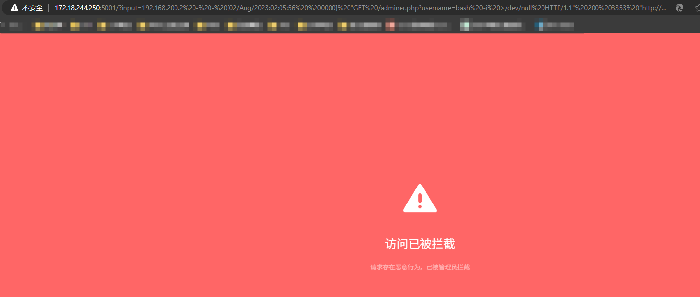
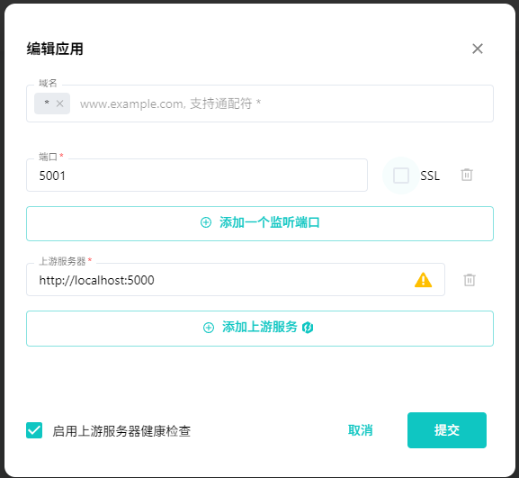
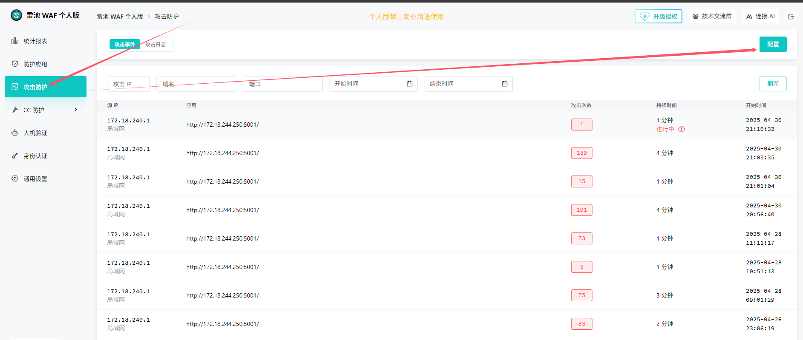
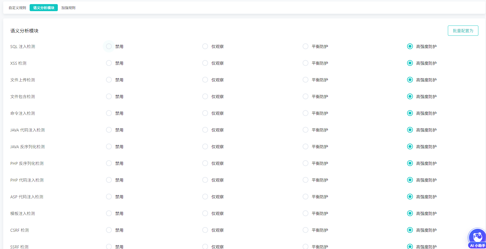
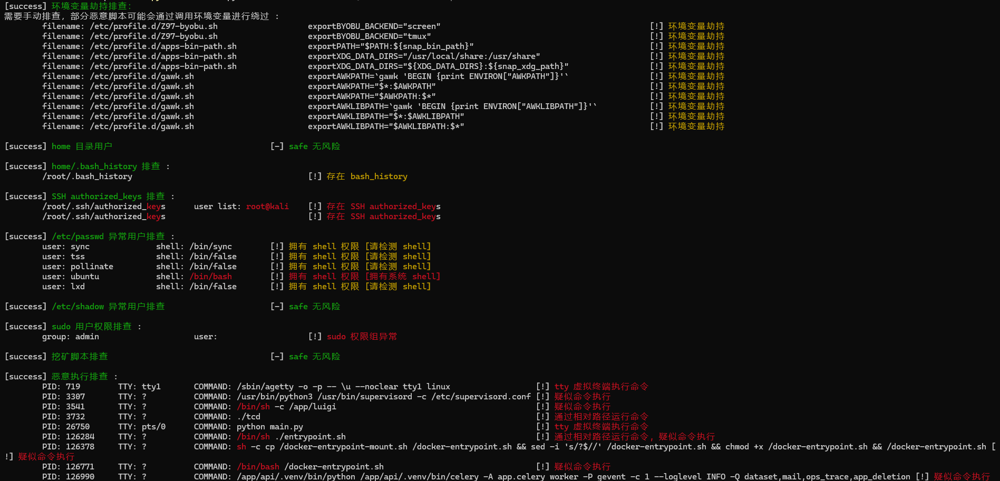
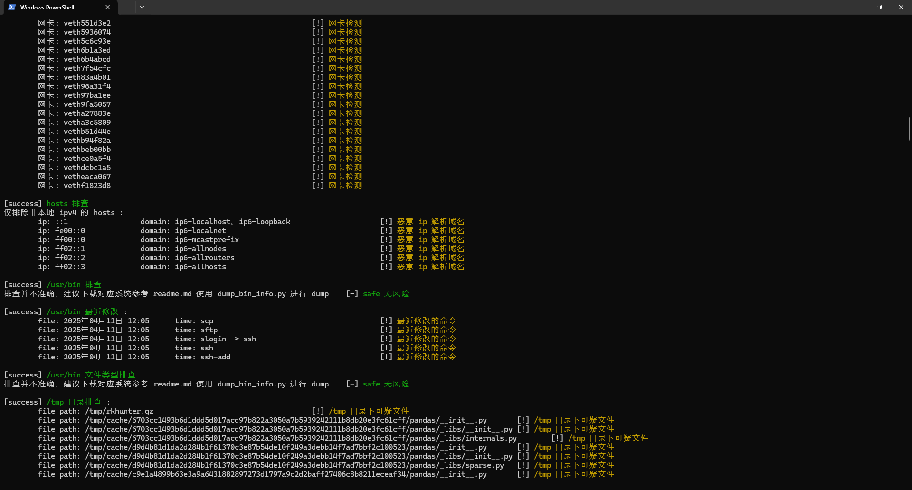
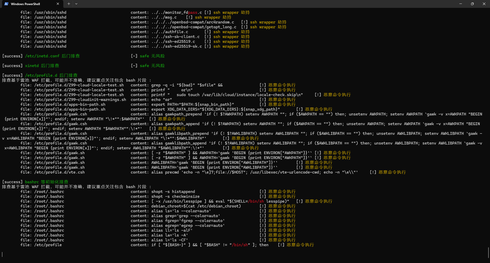
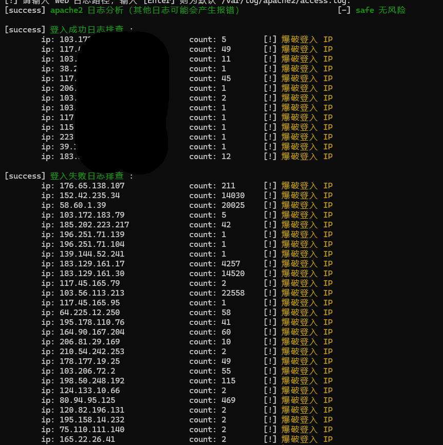

# CTF自动化应急响应工具
AI 深度索引文档说明 https://deepwiki.com/IHK-ONE/AutoIR_Remote

```plain
AutoIR/
  ├── __init__.py  
  │
  ├── AutoIR.py             # 主进程，用于接受传参
  │
  ├── DumpFileInfo.py       # /usr/bin 误判过高时，用于创建新的 bin_info.json 
  │
  ├── core/
  │   ├── __init__.py
  │   ├── core.py           # 核心，调用模块
  │   └── functions.py      # 静态方法
  │
  ├── data/
  │   ├── info_bin.json	    # /usr/bin 对比信息
  │   ├── info_proc.json    # ps 对比信息
  │   └── config.json       # 雷池 WAF 与 AI 配置
  │
  ├── extensions/
  │   ├── chkrookit         # rookit 检测扩展
  │   ├── HeMa              # 河马 webshell 检测
  │   └── llm               # AI 检测扩展（MCP）开发中
  │
  ├── downloads/
  │   └── 2024_01_01_01_01  # 时间戳 用于扫描 webroot 的 webshell
  │        └── html
  │
  └── plugins/
      ├── __init__.py 
      ├── User_Analysis.py  # 用户检测模块
      ├── ...
      ├── ...
      └── others.py         # 其他检测模块
```

# 参数列表
```plain
  -h, --help   show this help message and exit
  -t IP        Target IP address 目标地址
  -p PORT      SSH port 默认 22 端口
  -u USERNAME  SSH username 默认 root
  -k PASSWORD  SSH password 默认 root
```

# 功能列表
```plain
# 劫持排查
  1. 排查环境是否被劫持，以及劫持环境变量
  
# 恶意用户排查
  1. 排查 home 下用户
  2. 排查 /etc/passwd 下，拥有 shell 权限、root 权限、特殊权限的用户
  3. 排查 /etc/shadow 下，空口令用户（无密码登录用户）
  4. 排查 sudo 中权限异常用户
  5. 排查 拥有 authorized_keys 免密登录用户

# ProcAnalysis 恶意进程排查
  1. 排查 恶意挖矿脚本
  2. 排查 恶意启动，恶意命令执行的进程
  3. 排查 隐藏pid检
  4. 排查 被恶意替换命令名称的进程
  5. 排查 被恶意 mount 挂载的进程

# NetworkAnalysis 网络排查
  1. 分析网络对外连接
  2. 检测存在的网卡
  3. hosts 排查
  
# FileAnalysis 恶意文件检测
  1. /usr/bin 排查
  2. /tmp 排查
  3. webroot webshell
 
# BackdoorAnalysis 后门排查
  1. LD_PRELOAD后门检测
  2. LD_AOUT_PRELOAD后门检测
  3. LD_ELF_PRELOAD后门检测
  4. LD_LIBRARY_PATH后门检测
  5. ld.so.preload后门检测
  6. PROMPT_COMMAND后门检测
  7. cron后门检测
  8. alias后门
  9. ssh后门 ln -sf /usr/sbin/sshd /tmp/su; /tmp/su -oPort=5555;
  10. SSH Server wrapper 后门，替换/user/sbin/sshd 为脚本文件
  11. /etc/inetd.conf 后门
  12. /etc/xinetd.conf/后门
  13. setuid类后门
  14. /etc/fstab类后门（待写）
  13. 系统启动项后门检测

# LogAnalysis
  1. apache2 日志排查信息统计（并未制作 IIS Nginx Ruoyi 等服务日志审计，一般情况下 应急响应出题使用 Apache 居多）
  2. 登入成功和登入失败信息统计
  
# Rookit 排查
  1. 使用 rkhunter 实现
```

# 部署
1. 安装必备的库

```plain
pip install -r requirements.txt
```

2. 在本地安装 雷池 WAF（用于恶意内容检测）

安装雷池的教程：[安装雷池 | 雷池 SafeLine](https://docs.waf-ce.chaitin.cn/zh/上手指南/安装雷池) ，演示：实际发送到雷池的数据为拼接 apache 日志内容，雷池因为基于规则匹配，会对恶意内容进行拦截，不需要本地写规则匹配恶意内容，所以更加便捷，例如：

```plain
http://172.18.244.250:5001/?input=192.168.200.2 - - [02/Aug/2023:02:05:56  0000] "GET /adminer.php?username=bash -i >/dev/null HTTP/1.1" 200 3353 "http://192.168.200.47/adminer.php" "Mozilla/5.0 (Macintosh; Intel Mac OS X 10.15; rv:109.0) Gecko/20100101 Firefox/115.0"
```



3. 雷池安装后，开启一个简单的服务，只要能接受参数即可，让雷池 WAF 能够接收到内容，例如我的服务脚本

```python
from flask import Flask,request

app = Flask(__name__)
@app.route('/')
def index():
    if request.args.get('input'):
        return request.args.get('input')
    else:
        return 'service running'

if __name__ == '__main__':
    app.run('0.0.0.0', 5000)
```

4. 运行后在开启监听端口，本地服务器做上游服务器



5. 进入 攻击防护 -> 配置 -> 语义分析模块 批量配置为高强度防护





6. 访问监听端口，输入 bash -i 测试雷池是否拦截成功，拦截成功后，修改 /data/config.json 的 Server 为监听服务器

```json
{
  "SafeLineWAF": {
    "Server": "http://172.18.244.250:5001/?input=",
    "_Server": "请务必将 Server 改成 get 接收参数格式"
  },
  "OpenAI": {
    "API-Base": "*",
    "API-Key": "*"
  }
}
```

7. 至此，部署完毕，查看 AutoIR 参数进行应急

```plain
python AutoIR.py -h
```

# 效果









# 题目测试

题目测试所有题目均在玄机应急响应平台上
https://www.yuque.com/ihk_1/vcla01/ug7uxyry6rvf4kv8?singleDoc# 《题目测试》

# 其他问题

## /usr/bin 排查错误过多
当前代码的 /usr/bin 排查是基于 ubuntu + centos 的 WSL 镜像列出的 json 所以会非常不准确，建议创建一个与靶机相同镜像后，使用 DumpFileInfo.py 存储镜像，并进行替换 plugins 的 FileAnalysis.py

```plain
'''FileAnalysis.py
# 当 check_bin 误判率过高，使用该脚本
  1. 创建一个应急服务器的基础镜像（手动下载一个全新的镜像）
  2. 开启镜像 SSH 服务
  3. 填入信息后运行该脚本，拔取正确的 /usr/bin 文件信息
'''
```

## 代码可能会出现的状况
1. 代码会卡住，因为代码简单，基本都是暴力遍历并发送给雷池检测，很可能会卡住，如果卡住时间较长，可以查看卡住的地方，使用相同命令指向测试，如果指令会卡住说明有问题，在类初始化部分将该函数注释掉即可，或者使用 local 版本
2. 代码会报错，很大概率因为 cat 原因会报错，因为代码没有使用 strings ，但是基本都是文本处理，比如 redis 写入一个 .ssh/authorized_keys ，其前面会有二进制字符，无法被文本处理，此时会报错，解决方法如上
2. 很多地方并未做适配，比如日志分析只能分析 apache ，时间只支持 ubuntu centos 默认时间格式

## 能否用于 Linux 排查？
此项目只用于 CTF 方向的应急响应排查，切勿用于任何生产环境，功能稀少，仅仅为自用比赛的脚本，且只针对玄机应急响应平台进行测试，代码简陋仅满足个人需求，如果脚本有 bug 可以联系作者，大家也可自行修改代码

